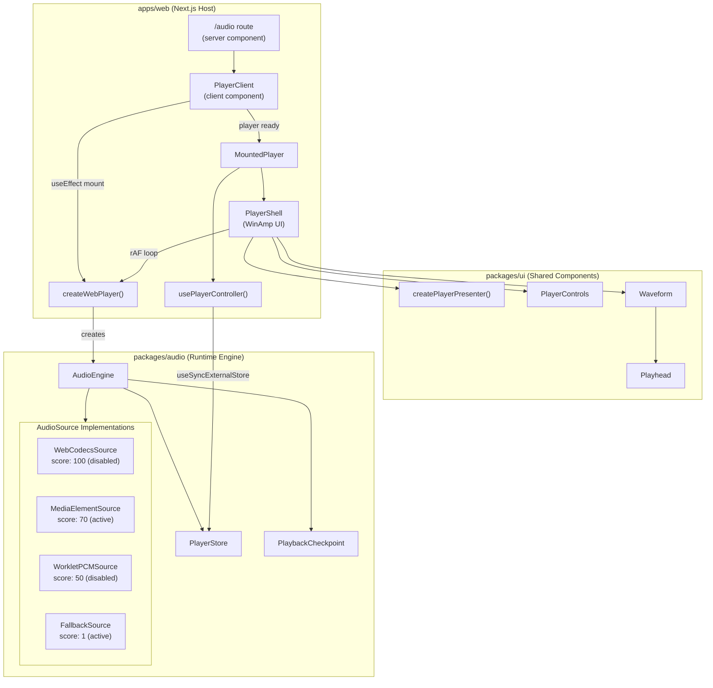
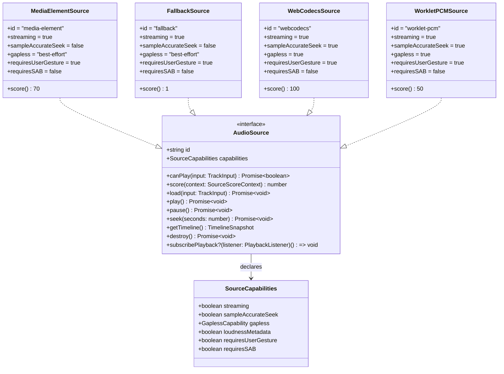
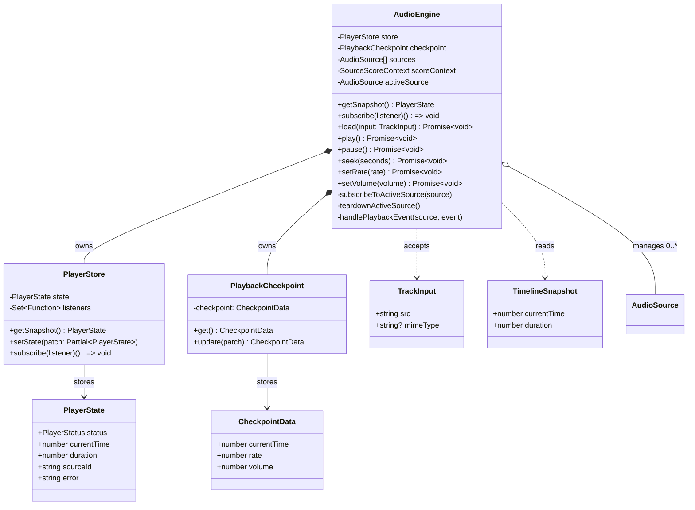
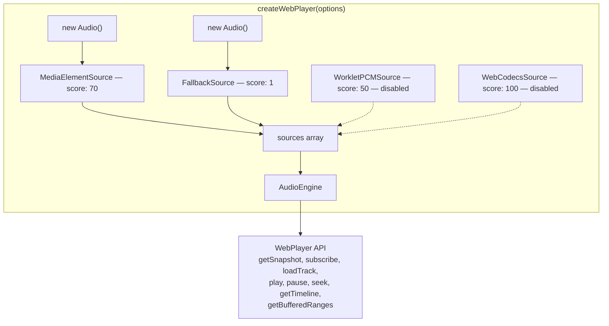

# Web Audio Player — Architecture Diagrams

System architecture and component relationships for the `@kkb/audio` package and web player integration.

## System Overview

High-level view of the three-layer architecture across the monorepo.

## AudioSource Interface

Class diagram showing the source contract and all implementations.

## Engine Internals

Class diagram of the `AudioEngine` and its internal collaborators.

## WebPlayer Factory

How `createWebPlayer()` composes sources and engine for the web host.

