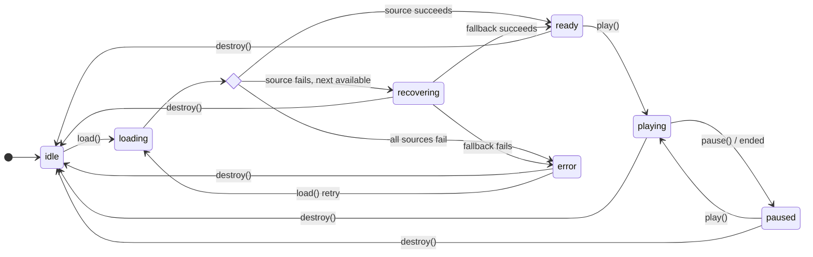
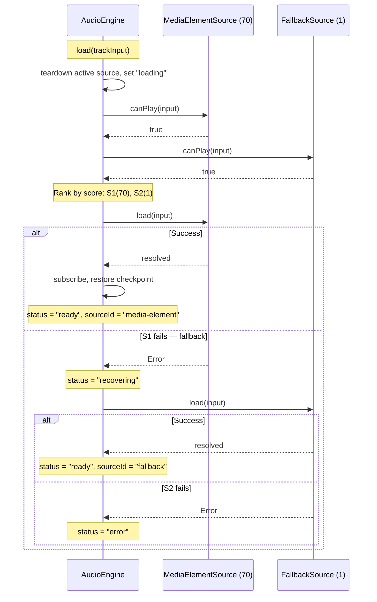
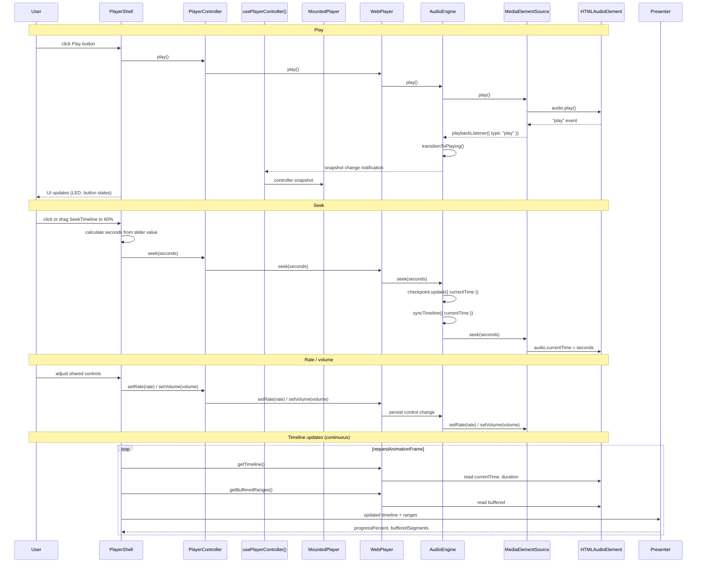
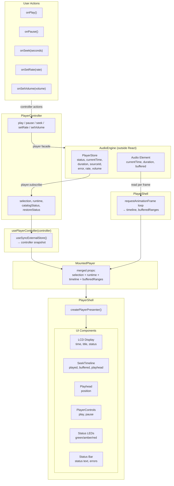
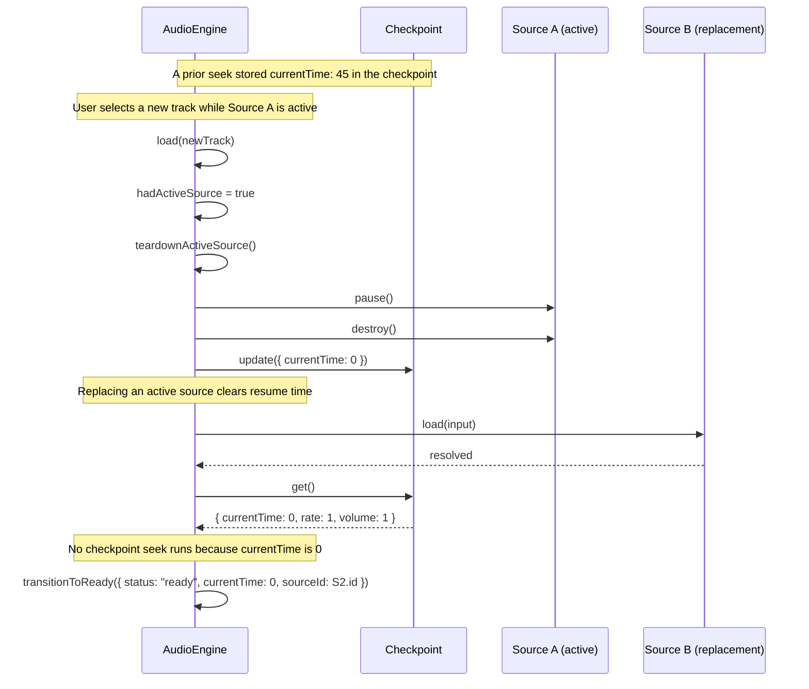

# Web Audio Player — State & Flow Diagrams

Player state machine, data flow, and interaction sequences.

## Player State Machine

State transitions managed by `PlayerStore` inside `AudioEngine`.

## Source Selection & Fallback

Sequence diagram showing how `engine.load()` ranks and attempts sources.

## Playback Interaction Flow

User interaction from click through engine to audio element.

## React Component Data Flow

How state flows from engine through React to UI components.

## Checkpoint Recovery on Source Switch

How checkpointed time behaves when a new `load()` replaces an existing source.

