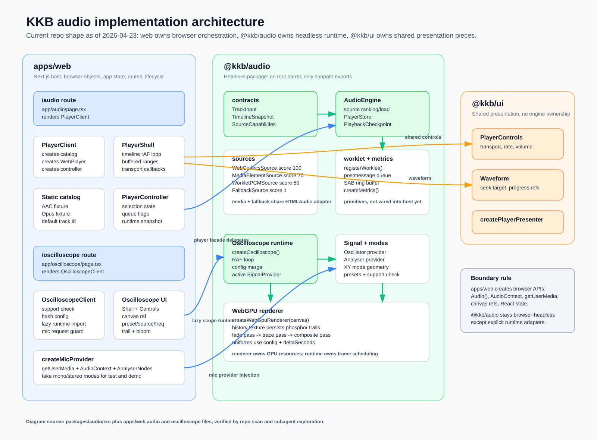
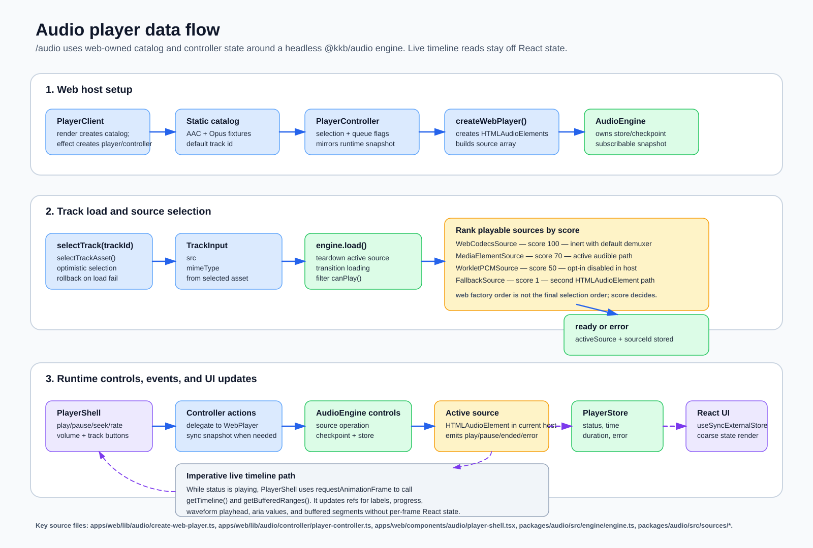
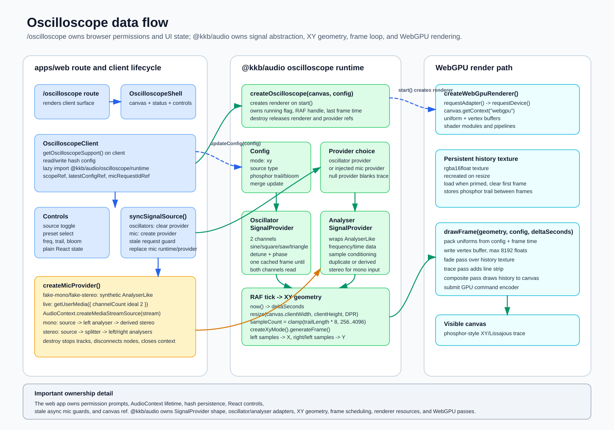

# Audio Implementation Diagrams

Current implementation reference for `@kkb/audio` plus all audio-related code in `apps/web`.

## System Architecture

## Audio Player Data Flow

## Oscilloscope Data Flow

## Source Notes

- `packages/audio` exports wildcard leaf subpaths only (for example `@kkb/audio/engine/engine` or `@kkb/audio/oscilloscope/runtime`), not directory entrypoints such as `@kkb/audio/engine`.
- `apps/web` owns browser orchestration for audio playback: `Audio()`, static catalog, controller state, route/component lifecycle, and UI actions.
- `apps/web` owns oscilloscope browser orchestration: `getUserMedia`, `AudioContext`, mic teardown, canvas refs, support state, hash persistence, and React controls.
- `@kkb/audio` owns the headless engine, source contracts, source selection, store/checkpoint, signal providers, XY geometry, oscilloscope runtime, and WebGPU renderer.
- `@kkb/ui` owns shared player presentation pieces used by the web audio page: controls, seek timeline, presenter, and theme classes.

Primary files checked:

- `packages/audio/package.json`
- `packages/audio/src/engine/engine.ts`
- `packages/audio/src/engine/store.ts`
- `packages/audio/src/engine/checkpoint.ts`
- `packages/audio/src/sources/*`
- `packages/audio/src/worklet/*`
- `packages/audio/src/oscilloscope/*`
- `apps/web/app/audio/page.tsx`
- `apps/web/components/audio/*`
- `apps/web/lib/audio/*`
- `apps/web/app/oscilloscope/page.tsx`
- `apps/web/components/oscilloscope/*`
- `apps/web/lib/oscilloscope/create-mic-provider.ts`
