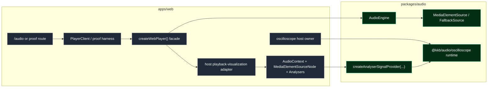

# Browser Oscilloscope Track Playback Spike Plan

Date: 2026-04-05  
Status: Proposed next slice after merge of PR #29  
Latest merged baseline:
- `docs/plans/2026-04-02-browser-oscilloscope-v1.md`
- `docs/reports/2026-04-04-oscilloscope-browser-smoke.md`
- `docs/reports/2026-04-04-oscilloscope-design-critique.md`

## Summary

Now that browser oscilloscope V1 has landed, the next slice should do two things in order:

1. **Finish the small post-merge hardening pass** that was intentionally left as non-blocking cleanup.
2. **Run the deferred track-playback integration spike** that the oscilloscope research and review docs identified as the main unresolved host-level dependency.

This slice is intentionally **not** a broad oscilloscope feature expansion. It should answer one narrow question:

> How should the current `apps/web` audio player expose track playback to the oscilloscope without breaking the repo's host/runtime boundary?

The expected output is:
- one small hardening commit or PR,
- one host-owned analyser/tap proof path in `apps/web`,
- browser-verified evidence that track playback can or cannot drive the oscilloscope credibly through the current media-element-first player architecture,
- and a follow-up report that recommends the shipping path for a future real `track` source in `/oscilloscope`.

---

## Docs and code context consulted

This plan is based on the current repo docs and runtime shape, especially:

- `docs/research/browser-oscilloscope.md`
- `docs/research/2026-03-28-browser-oscilloscope-review.md`
- `docs/plans/2026-04-02-browser-oscilloscope-v1.md`
- `docs/reports/2026-04-02-browser-oscilloscope-branch-review.md`
- `docs/reports/2026-03-28-monorepo-architecture-map.md`
- `docs/specs/2026-03-10-web-audio-player-rfc.md`
- `docs/specs/2026-03-12-web-audio-player-track-loading-selection-storage.md`
- `docs/diagrams/2026-03-10-web-audio-player-architecture.md`

And these code surfaces:

- `packages/audio/src/oscilloscope/renderer/pipeline.ts`
- `apps/web/lib/audio/create-web-player.ts`
- `apps/web/lib/audio/controller/player-controller.ts`
- `packages/audio/src/engine/engine.ts`
- `packages/audio/src/sources/media-element-source.ts`
- `packages/audio/src/sources/media-element-shared.ts`

---

## Why this is the right next step

The oscilloscope V1 work solved the hard structural questions:

- `@kkb/audio/oscilloscope` is headless
- `apps/web` owns browser-only orchestration
- mic input is host-managed and provider-backed
- the renderer and `/oscilloscope` route now exist and are browser-verified

The next real dependency is the one the research docs kept calling out:

- **track playback visualization is not a cheap extension of the current player**
- the current host path is **media-element-first**
- the oscilloscope should still consume a `SignalProvider`, not engine internals

That means the next slice should not jump straight to a polished end-user `track` source in `/oscilloscope`. It should first answer the host-integration question truthfully.

---

## Primary goals

### Goal 1 — post-merge hardening
Land the narrow cleanup items that were intentionally left out of PR #29:
- cache the composite bind group instead of recreating it every frame
- make an explicit decision about renderer/device cleanup
- optionally deduplicate tiny helper duplication only when directly touched by this work

### Goal 2 — host-owned track playback spike
Prove or disprove a practical analyser-tap path for the current web player without changing oscilloscope core ownership.

### Goal 3 — produce a clear recommendation
At the end of the slice, the repo should have a written answer to:
- whether the current media-element-first host path is sufficient for a future `/oscilloscope` track source
- what host abstraction should own playback analysis
- what remains blocked on larger player/runtime work

---

## Proposed integration map

This slice should preserve the existing host/runtime boundaries while adding one host-owned analysis seam beside the current player.



Key rule shown above:
- the host owns browser graph wiring
- the oscilloscope still receives only a `SignalProvider`
- the engine remains responsible for playback selection/recovery, not visualization graph exposure

---

## Architectural rules for this slice

These rules are mandatory.

1. **Do not teach `@kkb/audio/engine` to expose analyser nodes or browser graph internals.**  
   The engine should continue to own playback backend selection, fallback, and recovery only.

2. **Do not move browser graph ownership into `@kkb/audio/oscilloscope`.**  
   The oscilloscope still accepts a `SignalProvider` and remains agnostic about where it came from.

3. **Keep playback visualization integration in `apps/web`.**  
   The host should own any `AudioContext`, `MediaElementAudioSourceNode`, `ChannelSplitterNode`, and `AnalyserNode` wiring required for this spike.

4. **Do not expand the shared UI package for this work.**  
   No new `@kkb/ui` oscilloscope abstraction work belongs in this slice.

5. **Treat this as a spike plus minimal proof, not the final shipped product surface.**  
   A dev-lab or explicitly provisional host path is acceptable if it yields the right architecture decision.

---

## Current constraints that the spike must respect

### 1. The active player is media-element-first
`apps/web/lib/audio/create-web-player.ts` currently creates:
- a media-element-backed source,
- a fallback media-element-backed source,
- opt-in stubs for worklet PCM,
- opt-in stubs for WebCodecs.

In normal browser usage today, playback is usually coming from:
- `media-element`, or
- `fallback`

That is actually good news for the spike, because both are HTML-media-element-backed host surfaces.

### 2. The engine should not become a visualization graph owner
`packages/audio/src/engine/engine.ts` is correctly focused on:
- source selection
- fallback and recovery
- transport and checkpoint state

This spike should not push oscilloscope-specific graph exposure into the engine.

### 3. The oscilloscope core boundary is already correct
The oscilloscope docs and merged V1 implementation both agree on this:
- host owns browser graph wiring
- oscilloscope owns rendering and provider consumption

This slice should preserve that boundary, not reopen it.

---

## Recommended approach

## Phase 1 — harden the merged renderer path

### Goal
Finish the low-risk post-merge cleanup before opening a new integration frontier.

### Target files
- `packages/audio/src/oscilloscope/renderer/pipeline.ts`
- optionally `packages/audio/src/oscilloscope/renderer/__tests__/...`
- optionally `docs/plans/2026-04-05-browser-oscilloscope-post-v1-hardening-and-track-playback-spike.md`

### Tasks
- cache the composite bind group and rebuild it only when the history texture/view changes
- evaluate whether `renderer.destroy()` should explicitly call `device.destroy()`
  - if yes, implement it with tests or comments explaining assumptions
  - if no, document why the current cleanup boundary is intentional
- only deduplicate remaining tiny helpers if directly touched by this work; do not turn this into a cleanup sweep

### Acceptance
- no per-frame composite bind-group churn remains
- renderer cleanup behavior is an explicit decision rather than an open question
- tests, type-checks, and lint still pass

---

## Phase 2 — define the host-side playback analysis boundary

### Goal
Add one explicit host abstraction in `apps/web` for playback visualization taps.

### Recommended abstraction direction
Add a host-owned analysis/tap layer in `apps/web`, not `packages/audio`.

Reasonable shape:

```ts
type PlaybackAnalyserTap = {
  kind: "media-element" | "fallback";
  createSignalProvider(): Promise<{
    provider: SignalProvider;
    destroy(): Promise<void>;
  }>;
};
```

Or a manager shape:

```ts
type WebPlayerVisualization = {
  getPlaybackAnalyserTap(): PlaybackAnalyserTap | null;
};
```

The exact naming can change, but the ownership should not.

### Target files
- `apps/web/lib/audio/create-web-player.ts`
- new host files under something like:
  - `apps/web/lib/audio/visualization/*`
  - or `apps/web/lib/audio/analyser/*`

### Tasks
- design a host-only playback-analyser abstraction that can sit beside the existing `WebPlayer` facade
- keep it specific to browser-host graph wiring
- ensure it can report “unavailable” when the active source is not graph-tappable
- avoid leaking raw DOM elements or graph nodes far up the app tree

### Recommended decision
The initial abstraction should support:
- `media-element`
- `fallback`

It may explicitly return unavailable for:
- `webcodecs`
- `worklet-pcm`
- any future source that does not expose a host-tappable media element

### Acceptance
- there is one clear host-level API for “can I create a playback analyser-backed `SignalProvider` from the current player?”
- the oscilloscope package remains unchanged at the ownership level

---

## Phase 3 — build a minimal host graph proof path

### Goal
Prove that current track playback can feed analyser-backed XY visualization through a host-managed graph.

### Recommended implementation direction
For a media-element-backed active source:
- create or reuse a host-owned `AudioContext`
- create one `MediaElementAudioSourceNode` for the active element
- route through a `ChannelSplitterNode` if needed
- create one or two `AnalyserNode`s
- connect audible output to the context destination
- wrap those analysers with the existing `createAnalyserSignalProvider(...)`

### Important constraints
- a given media element can only be wrapped by `createMediaElementSource(...)` once per `AudioContext` lifecycle
- the host layer must avoid building duplicate source nodes for the same element
- the path must handle source teardown and active-source replacement cleanly
- if autoplay/user-gesture issues force `AudioContext.resume()`, the host should own that policy and expose readable failure states

### Target files
- `apps/web/lib/audio/create-web-player.ts`
- new host files under `apps/web/lib/audio/visualization/` or equivalent
- possibly a focused proof harness in `apps/web/app/*`
- `packages/audio/src/oscilloscope/signal/analyser-source.ts` only if a tiny host-facing option is needed

### Strong recommendation for the proof harness
Do **not** immediately add a polished `track` option to the existing `/oscilloscope` source UI.

Instead, prefer one of these:
- a dev-only proof route,
- a lab-only integration surface under `apps/web/app/audio/*`, or
- a minimal host harness not yet presented as finished product UI.

That keeps the spike honest and avoids prematurely shipping an interaction model before the graph path is proven.

### Acceptance
- one active playback path can drive the oscilloscope through an analyser-backed `SignalProvider`
- playback remains audible
- the proof path survives track changes and teardown without obvious leaks or stale graph state

---

## Phase 4 — browser verification and decision capture

### Goal
Collect enough browser evidence to make the architecture decision durable.

### Required verification
Use `agent-browser` and checked-in docs/artifacts for this slice.

Minimum cases:
- baseline audio playback still works on `/audio`
- the proof visualization path renders visible motion from track playback
- switching tracks does not leave stale graph state behind
- teardown or route-exit cleans up the analysis path
- unsupported/unavailable cases are readable if the active source cannot provide a tap

### Suggested deliverables
- a new browser smoke or spike report under `docs/reports/`
- annotated screenshots for the proof path
- one concise recommendation section:
  - ship later as a real `/oscilloscope` source
  - continue only after more host work
  - or block on larger player/runtime changes

### Acceptance
- the repo has browser evidence, not just code inspection
- the end of the slice produces a recommendation the next worker can trust

---

## Scope

### In scope
- oscilloscope renderer hardening in `packages/audio/src/oscilloscope/renderer/pipeline.ts`
- a host-owned playback analysis/tap abstraction in `apps/web`
- a minimal proof harness for track playback visualization
- tests and browser verification directly related to the spike
- a checked-in report capturing the decision

### Out of scope
- Y-T mode
- new oscilloscope display families
- shipping a polished end-user `track` source in `/oscilloscope`
- teaching `AudioEngine` to expose internal graph nodes
- worklet/SAB transport for visualization
- `@kkb/ui` oscilloscope package expansion
- large player UI changes
- WebCodecs or worklet playback enablement as part of this slice

---

## File map

### Likely touched
- `packages/audio/src/oscilloscope/renderer/pipeline.ts`
- `apps/web/lib/audio/create-web-player.ts`
- `apps/web/lib/audio/controller/player-controller.ts` only if a tiny host-facing hook is genuinely needed
- `apps/web/lib/audio/visualization/*` or `apps/web/lib/audio/analyser/*` new host-owned files
- a small proof harness route under `apps/web/app/*` if needed for browser verification
- `docs/reports/*` for the spike result

### Should probably stay untouched
- `packages/audio/src/engine/*` for graph exposure
- `packages/audio/src/oscilloscope/runtime.ts` for ownership changes
- `packages/ui/*` except for trivial proof-harness UI reuse

---

## Risks

1. **Media-element graph constraints may be awkward in practice.**  
   The spike may reveal that source-node lifecycle is more fragile than expected.

2. **User-gesture / `AudioContext` resume policy may complicate the proof.**  
   That is acceptable; the spike should capture it rather than hand-wave it.

3. **It is easy to accidentally ship product UI during a spike.**  
   Resist that. Keep the proof surface narrow.

4. **The spike could drift into generalized player refactoring.**  
   Avoid this unless the proof path makes a clear, minimal host refactor unavoidable.

---

## Guardrails

- keep the oscilloscope core boundary fixed
- keep engine ownership fixed
- prefer host-only additions in `apps/web`
- prove one path before generalizing
- stop once the host integration answer is clear

---

## Validation checklist

- [ ] `bun run test -- --filter=@kkb/audio --filter=@kkb/web`
- [ ] `bun run check-types -- --filter=@kkb/audio --filter=@kkb/web`
- [ ] `bun run format-and-lint`
- [ ] targeted tests for the hardening changes
- [ ] targeted tests for the host playback-analysis abstraction
- [ ] browser verification with `agent-browser`
- [ ] checked-in spike report under `docs/reports/`

---

## Tight execution checklist

### Phase 1 — hardening
- [ ] Cache the composite bind group in `packages/audio/src/oscilloscope/renderer/pipeline.ts`
- [ ] Make an explicit renderer/device cleanup decision
- [ ] Add or update focused tests if needed

### Phase 2 — define host analysis boundary
- [ ] Re-read `apps/web/lib/audio/create-web-player.ts`
- [ ] Decide the host-owned playback analysis/tap interface
- [ ] Add new host files for graph/tap ownership instead of extending `@kkb/audio`

### Phase 3 — proof path
- [ ] Build one media-element-backed analyser proof path
- [ ] Reuse `createAnalyserSignalProvider(...)` rather than inventing a new oscilloscope-side signal contract
- [ ] Keep playback audible and teardown clean
- [ ] Prefer a dev-lab/proof harness over polished product UI

### Phase 4 — verify and record
- [ ] Verify baseline `/audio` playback still works
- [ ] Verify the proof path shows visible track-driven oscilloscope motion
- [ ] Verify track switching / teardown behavior
- [ ] Save screenshots and notes in a new report
- [ ] End the slice with a clear recommendation for the future real `track` source

---

## Definition of done

This slice is done when:

- the merged oscilloscope renderer path has its remaining easy hardening issues addressed
- `apps/web` has one explicit, host-owned playback-analysis abstraction
- one browser-verified proof path demonstrates track playback feeding the oscilloscope through an analyser-backed provider
- the repo has a written recommendation for whether and how to ship a real playback-backed `track` source later
- no core oscilloscope or engine ownership boundaries were blurred in the process

---

## Recommended stop condition

Stop this slice once the architecture answer is clear.

A successful outcome is not “ship everything.” A successful outcome is:
- the hardening work is done,
- the host-owned track playback tap path is proven or disproven,
- and the next product slice can proceed without guessing.