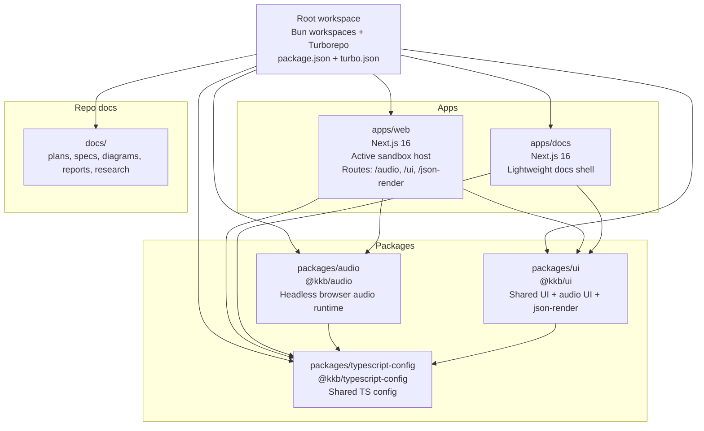
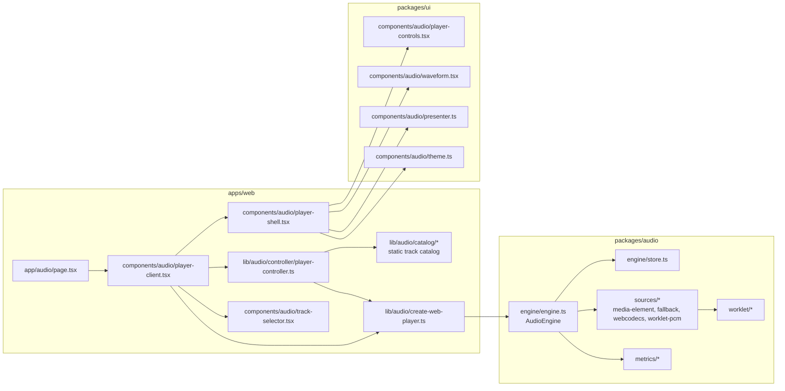

# Monorepo Architecture Map

**Date:** 2026-03-28  
**Repo:** `kkb`

This document maps the monorepo as it exists today on `main`.

## Architecture Summary

The repo is a **Bun workspace + Turborepo** monorepo with two Next.js apps and three active shared packages.

At a high level:

- `apps/web` is the primary integration host and demo sandbox.
- `apps/docs` is present, but still acts as a minimal shell rather than the main source of written documentation.
- `packages/audio` provides a headless browser audio runtime.
- `packages/ui` provides shared UI primitives, audio presentation components, and `json-render` integration.
- `packages/typescript-config` centralizes TS config.
- Root scripts delegate orchestration to Turborepo; Biome runs directly from the root.

## High-Level Monorepo Map

## Runtime and Build Shape

### Root orchestration

The root workspace currently owns:

- dependency management via Bun workspaces
- cross-workspace orchestration via `turbo run ...`
- direct Biome formatting/linting

Root scripts:

- `bun run dev`
- `bun run build`
- `bun run check-types`
- `bun run test`
- `bun run format-and-lint`
- `bun run format-and-lint:fix`

### Current Turbo task shape

The active root tasks are:

- `build`
- `dev`
- `check-types`
- `test`

Practical implications of the current setup:

- both apps define `build`
- `@kkb/audio` and `@kkb/ui` define `check-types` and `test`, but **not** `build`
- shared packages are currently consumed directly from source rather than emitted build artifacts

## Current Application Surfaces

### `apps/web`

`apps/web` is the active host for shared package development and verification. Its main routes are:

- `/audio` — full audio player demo
- `/ui` — visual component catalog and verification route
- `/json-render` — JSON-driven rendering demos using `@kkb/ui`'s `json-render` surface

Architecturally, this app is where package boundaries are made concrete.

### `apps/docs`

`apps/docs` currently provides only a simple shell. The repo's actual substantive written docs still live in top-level `docs/`.

That means the docs story is currently split:

- **product/app shell docs** in `apps/docs`
- **real planning/spec/research docs** in `docs/`

## Shared Package Architecture

### `@kkb/audio`

`packages/audio` is the most layered runtime package in the repo. Its main subdomains are:

- `contracts/`
- `engine/`
- `sources/`
- `worklet/`
- `metrics/`

The package is intentionally headless: it owns runtime behavior, not host UI or route composition.

### `@kkb/ui`

`packages/ui` has grown into a broad internal UI package. It currently includes:

- general UI primitives
- audio presentation primitives
- theming/styling helpers
- `json-render` exports and catalog wiring

It is both a shared component package and an experimentation surface for route-level demos in `apps/web`.

### `@kkb/typescript-config`

This package is purely infrastructural. It is shared by both apps and both main packages.

## Audio Integration Map

The clearest architecture in the repo today is the audio stack. Host concerns stay in `apps/web`, runtime concerns stay in `@kkb/audio`, and presentation concerns are split between `apps/web` and `@kkb/ui`.

## Audio Runtime Notes

The current audio host wiring shows a deliberate separation of concerns:

- `apps/web` owns selection, catalog, orchestration, and route composition
- `@kkb/audio` owns playback runtime behavior
- `@kkb/ui` owns reusable controls and visual presentation primitives

In the web host today:

- `MediaElementSource` and `FallbackSource` are the practical active sources
- `WebCodecsSource` and `WorkletPCMSource` exist, but remain opt-in/disabled in the browser host until more integration work lands
- the catalog is fixture-driven rather than backend-driven

## JSON Render Integration Map

A second important architecture path is the `json-render` route.

- `apps/web/app/json-render/*` owns route-level demos
- `@kkb/ui/json-render` exports the reusable integration surface
- `@json-render/core`, `@json-render/react`, and `@json-render/shadcn` are external dependencies composed inside `@kkb/ui`

This makes `@kkb/ui` the internal adapter layer between generic JSON rendering libraries and the repo's component usage patterns.

## Architectural Strengths

1. **Clear host/runtime split in audio**
   - Host orchestration is separate from engine internals.
2. **`apps/web` acts as an integration lab**
   - Shared packages have a concrete place to be exercised.
3. **Good doc trail for audio and UI work**
   - `docs/plans`, `docs/specs`, and `docs/diagrams` already capture design intent.
4. **Dependency hygiene has recently improved**
   - Bun catalogs and cleaner root dependency ownership reduce drift.

## Current Architectural Constraints

1. **`apps/docs` is not yet the canonical docs surface**
   - repo docs still primarily live in top-level `docs/`
2. **Shared packages do not currently emit build artifacts**
   - good for internal source consumption, less ready for external publishing
3. **`@kkb/ui` is becoming broad**
   - it now covers general UI, audio UI, and `json-render`, which may eventually need clearer internal boundaries
4. **Audio demo remains fixture-based**
   - strong for local verification, but still far from production content/data flows

## Takeaway

Today, the monorepo is best understood as a **product workbench**:

- one active app (`apps/web`)
- one placeholder app (`apps/docs`)
- one serious runtime package (`@kkb/audio`)
- one broad shared UI/integration package (`@kkb/ui`)
- one infrastructure package (`@kkb/typescript-config`)

The architecture is already strong enough to support iterative product exploration, especially around audio and UI systems, but still early in backend integration, publishing strategy, and canonical docs delivery.
