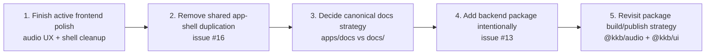

# Monorepo Prioritized Next Steps

**Date:** 2026-03-28  
**Repo:** `kkb`

This document recommends the next work to prioritize based on the current codebase, recent git history, and GitHub issues queried with `gh`.

## What Recently Landed

Recent work on `main` clusters into three themes:

### 1. `/ui` catalog delivery

Closed issues:

- `#17` add `/ui` visual component catalog
- `#18` scaffold `/ui` catalog route and layout
- `#19` add interactive demo islands
- `#20` add audio demos and finalize `/ui` verification
- `#21` build core `/ui` catalog sections
- `#24` finish `/ui` browser QA signoff
- `#25` clear pre-existing biome debt blocking format-and-lint

### 2. Repo/docs/dependency cleanup

Closed issues:

- `#14` clean up root package.json dependencies and align versions
- `#26` refresh stale `/ui` and monorepo planning docs

### 3. Audio runtime and architecture cleanup

Closed issues:

- `#5` harden engine error contract
- `#6` add missing test coverage
- `#7` store and controller state model improvements
- `#8` controller UX edge cases
- `#9` integrate or remove typed error hierarchy
- `#10` deduplicate source implementations and shared types
- `#11` type safety improvements
- `#12` code comments and diagram accuracy
- `#15` tokenize audio component colors into theme system

## Open GitHub Issues

Current open issues visible via `gh issue list --state open`:

- `#16` `ui: deduplicate font files and shared layout across apps`
- `#13` `feat: add @kkb/convex package`

## Recommendation: Sequenced Work Plan

## Priority 1 — Finish active frontend polish around audio

### Why this should be first

`apps/web` is the active product lab, and the `/audio` route is still one of the most architecture-rich demos in the repo. Even after the runtime cleanup, there are still visible UX gaps in current code and planning docs:

- transport buttons for previous / stop / next are still disabled in `@kkb/ui`'s `player-controls`
- `player-shell` still shows decorative hardcoded diagnostics (`128 kbps`, `44 khz`)
- the demo remains fixture-driven and still carries some verification-only affordances

There is already a plan document for these gaps:

- `docs/plans/2026-03-20-audio-ux-follow-up-gaps.md`

### Outcome

Use the strong runtime foundation to make the audio demo feel complete at the interaction layer.

### Suggested scope

- enable previous / stop / next transport semantics
- remove or neutralize fake diagnostics
- tighten initial metadata/duration accessibility behavior
- refresh dogfood docs once changes land

### Why now

This work compounds the value of the recent audio hardening effort and improves one of the repo's best demos without introducing new product surface area.

## Priority 2 — Resolve shared app-shell duplication (`#16`)

### Why this is next

This is the clearest low-risk refactor still open in GitHub.

Issue `#16` is well-scoped:

- deduplicate the largely shared app layout shell across `apps/web` and `apps/docs`
- treat the font-asset move as a separate feasibility spike, not a blocker

### Outcome

- less duplication between the two Next.js apps
- cleaner ownership of shared shell concerns
- better foundation if `apps/docs` grows up later

### Why not first

It is important, but less user-visible than tightening the active `/audio` experience.

## Priority 3 — Decide the canonical docs strategy

### Why this matters

The repo currently has two documentation homes:

- `apps/docs` as a minimal app shell
- top-level `docs/` as the real home for plans, specs, diagrams, research, and reports

That split is workable in the short term, but it is still a product and maintenance decision waiting to be made.

### Decision options

1. **Promote `apps/docs` into the real docs product**
   - best if public-facing docs matter soon
2. **Keep `apps/docs` minimal and embrace `docs/` as canonical**
   - best if docs remain mostly internal planning artifacts for now
3. **Hybrid approach**
   - `docs/` stays canonical for engineering artifacts
   - `apps/docs` becomes curated/published docs later

### Recommendation

Use the hybrid approach unless there is an immediate public-docs requirement.

## Priority 4 — Add `@kkb/convex` only after intent is clear (`#13`)

### Why this is not top priority

Issue `#13` is promising, but it is materially larger than the current open cleanup work. It introduces:

- backend data modeling
- auth integration
- workspace and env management
- development workflow changes
- a new product direction for the monorepo

### When it becomes the right next move

Move on this once there is agreement on at least one concrete product flow that needs persisted backend state.

### Outcome

A Convex package makes sense if the repo is ready to evolve from a frontend systems lab into a fuller application platform.

## Priority 5 — Decide whether shared packages stay source-only

### Why this should be considered soon

Today, `@kkb/audio` and `@kkb/ui` are internal-first packages consumed directly from source. That is perfectly fine for current monorepo use, but it leaves an open architectural choice:

- keep optimizing for internal workspace development
- or start preparing for package publishing / clearer compiled boundaries

### Signals that this decision is becoming urgent

- more apps are added
- external consumption is desired
- build time and package boundary issues increase
- `@kkb/ui` keeps broadening in scope

### Outcome

A conscious decision here will prevent accidental drift into a half-internal, half-published package model.

## Recommended Now / Next / Later View

| Window | Recommendation | Why |
|---|---|---|
| **Now** | audio UX polish | highest value on active demo surface |
| **Now** | shared layout/app-shell cleanup (`#16`) | low-risk, clearly scoped cleanup |
| **Next** | docs strategy decision | resolves current split-brain docs model |
| **Next** | backend/package direction review | needed before Convex expansion |
| **Later** | compiled package/publishing strategy | useful once workspace surface expands further |

## What Not To Prioritize Yet

### 1. Large new app/package proliferation

The repo is still getting strong leverage from one active app plus shared packages. Adding more apps too early would increase surface area faster than it increases clarity.

### 2. Premature package publishing work

Unless there is a real external consumer, current source-based package consumption is acceptable.

### 3. Turning `apps/docs` into a full docs product by default

That should be a conscious product decision, not background drift.

## Bottom Line

The repo has just finished a meaningful UI catalog and cleanup phase. The best next move is **not** another large new subsystem by default.

The highest-leverage sequence is:

1. complete the visible frontend/audio polish still implied by current code and plans
2. remove the obvious shared app-shell duplication
3. choose the long-term docs and backend direction deliberately
4. only then expand the monorepo's backend/package footprint
