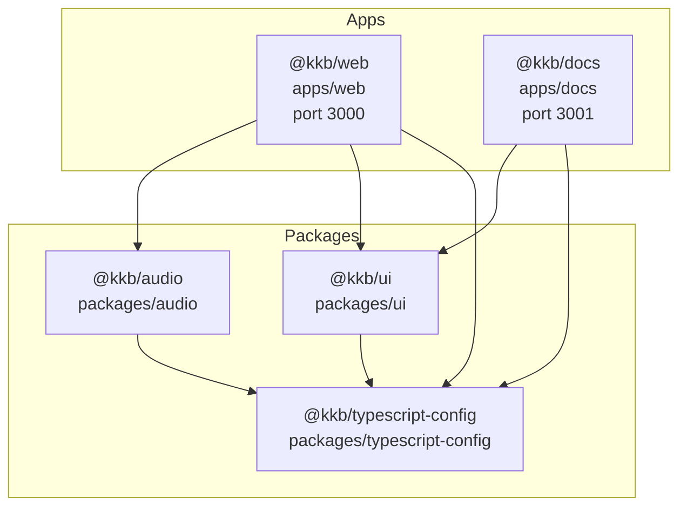
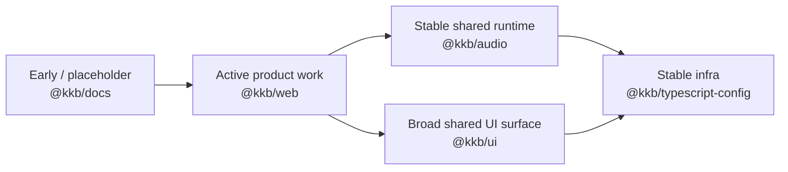

# Monorepo Workspace Inventory

**Date:** 2026-03-28  
**Repo:** `kkb`

This document inventories the current workspaces, what they do, how mature they are, and how they relate to each other.

## Inventory Diagram

## Root Workspace

| Area | Current state |
|---|---|
| Package manager | Bun (`bun@1.3.10`) |
| Orchestration | Turborepo (`turbo`) |
| Formatting/linting | Biome |
| Language/tooling | TypeScript 6, Next.js 16, React 19 |
| Workspaces | `apps/*`, `packages/*` |

### Root scripts

| Script | Purpose |
|---|---|
| `bun run dev` | delegates to `turbo run dev` |
| `bun run build` | delegates to `turbo run build` |
| `bun run check-types` | delegates to `turbo run check-types` |
| `bun run test` | delegates to `turbo run test` |
| `bun run format-and-lint` | runs `biome check .` |
| `bun run format-and-lint:fix` | runs `biome check --write .` |

### Turbo task notes

| Task | Current coverage |
|---|---|
| `dev` | apps define dev servers; root orchestrates |
| `build` | currently defined by `@kkb/web` and `@kkb/docs` |
| `check-types` | defined by `@kkb/web`, `@kkb/docs`, `@kkb/audio`, `@kkb/ui` |
| `test` | defined by `@kkb/web`, `@kkb/audio`, `@kkb/ui`; not defined by `@kkb/docs` |

## Workspace Summary Table

| Workspace | Type | Role | Maturity | Build | Check types | Test |
|---|---|---|---|---|---|---|
| `@kkb/web` | app | active demo/sandbox host | active | yes | yes | yes |
| `@kkb/docs` | app | lightweight docs shell | early | yes | yes | no |
| `@kkb/audio` | package | headless browser audio runtime | active | no | yes | yes |
| `@kkb/ui` | package | shared UI + audio UI + json-render | active | no | yes | yes |
| `@kkb/typescript-config` | package | shared TS config | stable infra | no | no | no |

## `@kkb/web` — `apps/web`

### Responsibility

The active integration app for the monorepo. It is where shared packages are demonstrated, validated, and composed into real routes.

### Current routes

- `/`
- `/audio`
- `/ui`
- `/json-render`

### Scripts

| Script | Command |
|---|---|
| `dev` | `next dev --port 3000` |
| `build` | `next build` |
| `start` | `next start` |
| `check-types` | `next typegen && tsc --noEmit` |
| `test` | `bun test --pass-with-no-tests` |

### Internal dependencies

- `@kkb/audio`
- `@kkb/ui`
- `@kkb/typescript-config`

### Key areas

- `app/audio/page.tsx`
- `app/ui/page.tsx`
- `app/json-render/*`
- `components/audio/*`
- `components/ui-catalog/*`
- `lib/audio/*`

### Notes

- This is the monorepo's most important app today.
- It functions both as a demo surface and as a verification surface for shared packages.
- It contains host-specific audio orchestration that intentionally does **not** live inside `@kkb/audio`.

## `@kkb/docs` — `apps/docs`

### Responsibility

A lightweight docs shell app. It is present and buildable, but it is not yet the repo's main documentation surface.

### Scripts

| Script | Command |
|---|---|
| `dev` | `next dev --port 3001` |
| `build` | `next build` |
| `start` | `next start` |
| `check-types` | `next typegen && tsc --noEmit` |

### Internal dependencies

- `@kkb/ui`
- `@kkb/typescript-config`

### Key areas

- `app/page.tsx`
- `app/layout.tsx`

### Notes

- Current content is minimal.
- The repo's actual plans/specs/research/reports live under top-level `docs/`.
- The main open question is whether this app should become the public docs surface or remain intentionally lightweight.

## `@kkb/audio` — `packages/audio`

### Responsibility

Headless browser audio runtime package.

### Scripts

| Script | Command |
|---|---|
| `check-types` | `tsc --noEmit` |
| `test` | `bun test --pass-with-no-tests` |

### Major subdomains

- `src/contracts/`
- `src/engine/`
- `src/sources/`
- `src/worklet/`
- `src/metrics/`

### Export surface

- `./contracts/*`
- `./engine/*`
- `./sources/*`
- `./worklet/*`
- `./metrics/*`

### Notes

- This package is intentionally runtime-focused and headless.
- It currently has the clearest internal architecture of any package in the repo.
- It has meaningful unit coverage across engine, source, worklet, and metrics areas.
- It does not currently define a `build` script, so it is consumed internally from source.

## `@kkb/ui` — `packages/ui`

### Responsibility

Broad shared UI package for the repo.

### Scripts

| Script | Command |
|---|---|
| `check-types` | `tsc --noEmit` |
| `test` | `bun test --pass-with-no-tests` |

### Major subdomains

- `src/components/*`
- `src/components/audio/*`
- `src/hooks/*`
- `src/lib/*`
- `src/styles/*`
- `src/json-render/*`

### Export themes

- general UI components
- audio presentation components
- CSS/global style surfaces
- `json-render` adapter exports

### Notes

- This is currently the broadest package in the repo.
- It contains 59 top-level component files under `src/components/`.
- It now spans three concerns:
  1. general UI primitives
  2. audio UI/presentation primitives
  3. `json-render` integration
- Like `@kkb/audio`, it is consumed internally from source rather than built output.

## `@kkb/typescript-config` — `packages/typescript-config`

### Responsibility

Shared TypeScript configuration package used by the apps and packages.

### Scripts

None.

### Notes

- This package is infrastructure only.
- It is stable and low-churn relative to the other workspaces.

## Current Test Coverage Snapshot

This is not a full QA report, but the current test file counts help show where the repo's confidence is concentrated.

| Workspace | Approx. test file count |
|---|---|
| `apps/web` | 10 |
| `apps/docs` | 0 |
| `packages/audio` | 13 |
| `packages/ui` | 3 |

Interpretation:

- audio runtime behavior is relatively well-tested
- web host behavior has meaningful focused tests
- docs app is still too early to have its own test surface
- UI package has much broader component breadth than its current test count suggests

## Workspace Maturity View

## Takeaway

The inventory is intentionally uneven, but productively so:

- `@kkb/web` is where real work is exercised
- `@kkb/audio` is the deepest technical package
- `@kkb/ui` is the widest shared package
- `@kkb/docs` is present but not yet central
- `@kkb/typescript-config` is the quiet infrastructure layer holding the workspace together
