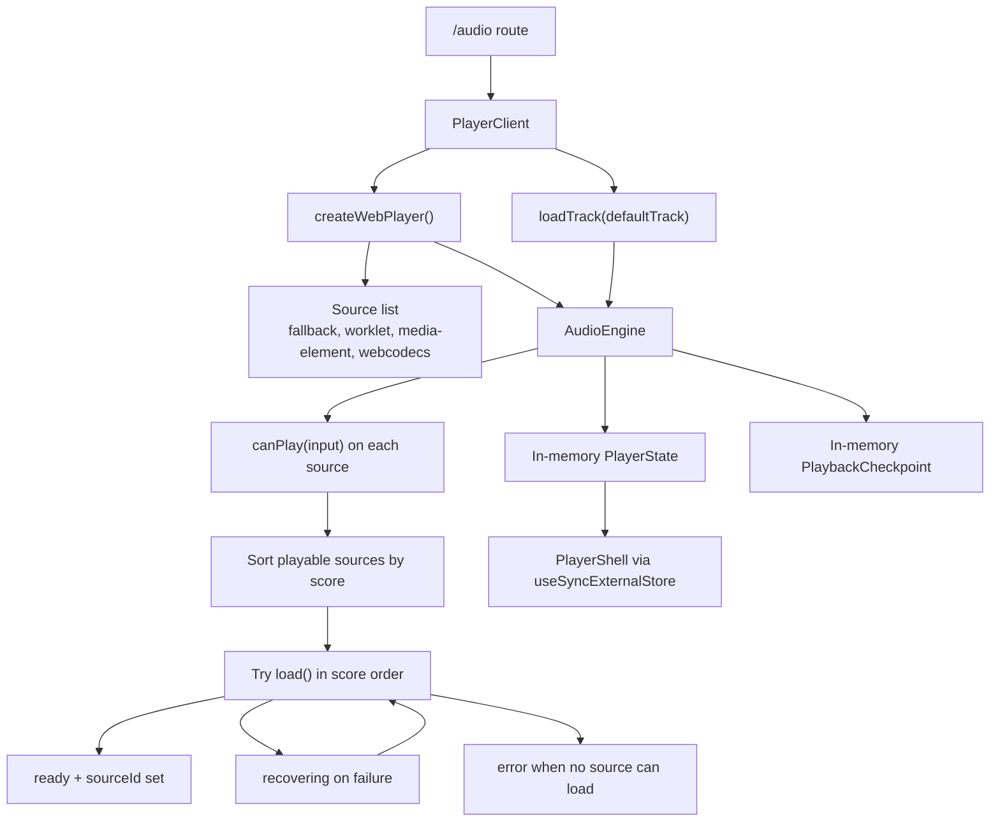
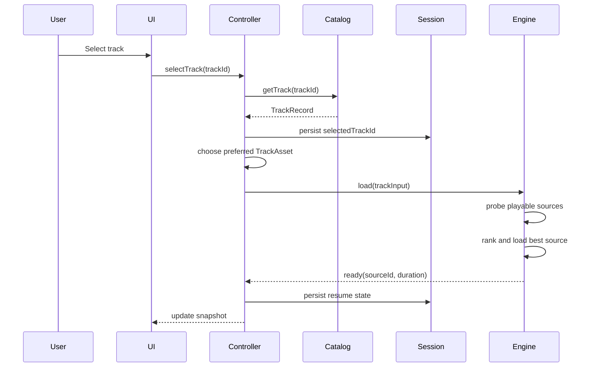
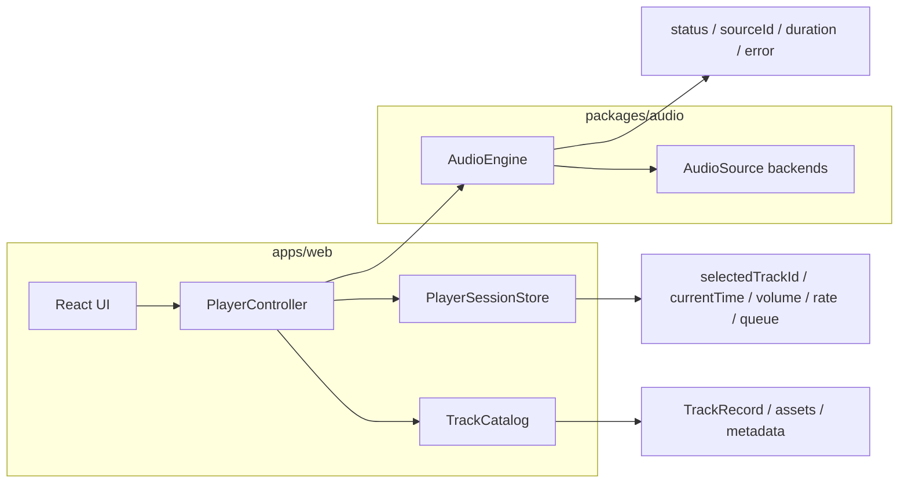

# Web Audio Player Track Loading, Selection, and Storage

Status: Proposed  
Last Updated: 2026-03-12  
Owner: KKB  
Audience: `apps/web`, `packages/audio`, `packages/ui`

## 1. Purpose

This document does two things:

1. Captures how audio track loading, storage, and selection work today in the web player.
2. Recommends a pragmatic design for evolving the player from a single hard-coded demo track into a real track-driven playback experience.

This document is intentionally narrower than the broader web audio player RFC. It focuses on the application-level questions around:

1. Where tracks come from.
2. How the app stores track metadata and playback state.
3. How the app selects a logical track.
4. How the engine selects a playback backend for that track.

## 2. Current State

### 2.1 What exists today

The current `/audio` route renders a single client component that creates one browser player instance and immediately loads one hard-coded default track.

Relevant files:

1. `apps/web/app/audio/page.tsx`
2. `apps/web/components/audio/player-client.tsx`
3. `apps/web/lib/audio/create-web-player.ts`
4. `packages/audio/src/engine/engine.ts`

The current behavior is:

1. `PlayerClient` mounts on the client.
2. It creates a `WebPlayer` with `createWebPlayer()`.
3. On mount, it calls `player.loadTrack(player.defaultTrack)`.
4. `defaultTrack` is hard-coded to `/audio/test-tone-aac.m4a`.
5. The engine evaluates available source backends and selects one.
6. The UI renders snapshot state from the engine with `useSyncExternalStore`.

### 2.2 Current track storage

There is no track catalog, no playlist model, and no API-backed track storage yet.

Current storage is split into two unrelated pieces:

1. Audio files live as static fixtures under `apps/web/public/audio/`.
2. Runtime playback state lives only in memory inside the engine store and playback checkpoint.

Current fixtures:

1. `apps/web/public/audio/test-tone-aac.m4a`
2. `apps/web/public/audio/test-tone-opus.webm`

Current runtime state:

1. `PlayerState` stores `status`, `currentTime`, `duration`, `sourceId`, and `error`.
2. `PlaybackCheckpoint` stores `currentTime`, `rate`, and `volume`.

There is currently no persistence layer for:

1. last selected track
2. playlist order
3. playback queue
4. resume position across page reloads
5. cached track metadata
6. artwork, waveform, or loudness metadata

There is also no browser persistence such as `localStorage`, `sessionStorage`, or IndexedDB in the current implementation.

### 2.3 Current selection behavior

Today there are two different kinds of selection, but only one is explicit in the app:

1. Logical track selection
2. Playback backend selection

Logical track selection is trivial today:

1. the app always selects one hard-coded track
2. there is no user-facing track picker
3. there is no track ID
4. there is no manifest or library lookup step

Playback backend selection is implemented in the engine:

1. each source reports whether it can play the input
2. playable sources are sorted by score
3. the engine tries them in score order
4. on failure, the engine falls through to the next source

Current source scores:

1. `WebCodecsSource`: `100`
2. `MediaElementSource`: `70`
3. `WorkletPCMSource`: `50`
4. `FallbackSource`: `1`

In the current browser wrapper, `enableWebCodecs` and `enableWorkletPCM` default to `false`, so the effective runtime usually ends up on `MediaElementSource`, with `FallbackSource` as the lowest-priority compatibility path.

### 2.4 Current flow diagram



### 2.5 Current strengths

The current implementation already has the right separation in a few important places:

1. source backend selection lives in `@kkb/audio`, not React
2. the engine owns fallback and recovery between backends
3. the host adapter in `apps/web` is thin
4. the UI subscribes to coarse playback state instead of owning it

Those are strong foundations and should not be undone.

### 2.6 Current gaps

The current player is still a demo integration rather than a real track system.

Key gaps:

1. no logical track model
2. no catalog or manifest
3. no distinction between track identity and track asset URL
4. no persistence of selected track or resume position across reloads
5. no queue, playlist, or next-track policy
6. no explicit loading states for catalog fetch versus engine load
7. no metadata layer for title, artist, artwork, waveform, or loudness info

## 3. Design Principles

The recommended design should preserve the parts that are already correct:

1. The engine should continue to own playback backend selection and recovery.
2. The app should own logical track selection, library lookup, and persistence.
3. Track identity should not be the same thing as a raw URL.
4. Persistence should start small and targeted instead of jumping straight to offline-first complexity.
5. The first real implementation should optimize for correctness and maintainability before advanced caching.

The key architectural distinction is:

1. The app selects a logical track.
2. The engine selects the best playback source for that track's asset.

That boundary keeps the responsibilities clean.

## 4. Approach Options

### Option A. Static manifest plus browser persistence

Description:

1. Store a checked-in track manifest in the repo.
2. Resolve track IDs to static asset URLs in the web app.
3. Persist last selected track and resume position in `localStorage`.

Pros:

1. fastest path from demo to usable player
2. no backend dependency
3. easy to verify in local development

Cons:

1. not suitable for a real library with changing content
2. weak metadata lifecycle
3. no authoritative source of truth outside the client bundle

Use when:

1. the near-term goal is a polished demo or internal prototype

### Option B. API-backed track catalog plus light client persistence

Description:

1. Store track metadata in an API-backed catalog or CMS-like source.
2. Return stable `trackId` records with one or more playable assets.
3. Persist only user/session playback state locally in the browser.

Pros:

1. clean separation between catalog data and local playback state
2. works for real product evolution
3. supports richer metadata and multiple asset variants

Cons:

1. requires catalog API work
2. adds manifest fetch and error handling complexity

Use when:

1. the player is expected to move beyond static fixtures soon

### Option C. Full offline-first media library

Description:

1. Store catalog metadata and downloaded media in IndexedDB.
2. Add background sync, asset pinning, and offline resume behavior.

Pros:

1. strongest offline story
2. supports aggressive buffering and caching strategies

Cons:

1. high complexity
2. quota management and eviction are non-trivial
3. too much scope for the current player maturity

Use when:

1. offline playback is a product requirement

### Recommendation

Recommend **Option B** as the target architecture, implemented in phases that begin with an Option A-shaped delivery.

That means:

1. start with a simple track catalog abstraction
2. keep the first host implementation compatible with static fixtures
3. add API-backed catalog storage behind the same interface
4. persist only lightweight session preferences locally at first

This keeps the design aligned with the existing RFC while avoiding feature creep.

## 5. Recommended Architecture

### 5.1 Separate logical tracks from playable assets

Introduce a host-level track model that is distinct from the engine's `TrackInput`.

Suggested types:

```ts
type TrackId = string;

type TrackAsset = {
  src: string;
  mimeType: string;
  codec?: string;
  bitrateKbps?: number;
  fileSizeBytes?: number;
};

type TrackRecord = {
  id: TrackId;
  title: string;
  artist?: string;
  album?: string;
  artworkUrl?: string;
  duration?: number;
  waveformUrl?: string;
  loudnessLufs?: number;
  assets: TrackAsset[];
  defaultAssetIndex?: number;
};
```

Recommended rule:

1. `TrackRecord` belongs to the app or catalog layer.
2. `TrackInput` remains the engine-facing playback input.
3. A small adapter resolves `TrackRecord` to the `TrackInput` handed to `AudioEngine`.

This avoids leaking catalog concerns into `@kkb/audio`.

Clarifications:

1. `TrackRecord.duration` is catalog metadata used for pre-load UI and list rendering.
2. Runtime duration shown during playback should still come from the engine's active source timeline.
3. `TrackAsset.mimeType` is the primary discriminator for asset selection.
4. `TrackAsset.codec` is optional descriptive metadata and may refine diagnostics or tie-breakers, but asset selection should not depend on it being present.

### 5.2 Add a catalog boundary in `apps/web`

Recommended host-level modules:

1. `apps/web/lib/audio/catalog/track-types.ts`
2. `apps/web/lib/audio/catalog/track-catalog.ts`
3. `apps/web/lib/audio/catalog/static-track-catalog.ts`
4. `apps/web/lib/audio/session/player-session-store.ts`
5. `apps/web/lib/audio/controller/player-controller.ts`

Responsibilities:

1. `track-catalog`: fetch or read track records
2. `player-session-store`: persist last selected track and preferences
3. `player-controller`: orchestrate track selection and calls into `WebPlayer`

The React components should consume the controller and snapshot state, not own the orchestration directly.

Suggested controller interface:

```ts
type CatalogStatus = "idle" | "loading" | "ready" | "error";
type RestoreStatus = "idle" | "restoring" | "complete" | "error";

type PlayerControllerSnapshot = {
  catalogStatus: CatalogStatus;
  restoreStatus: RestoreStatus;
  selectedTrackId: string | null;
  selectedTrack: TrackRecord | null;
  queueTrackIds: string[];
  asset: TrackAsset | null;
  runtime: {
    status: "idle" | "loading" | "ready" | "playing" | "paused" | "recovering" | "error";
    currentTime: number;
    duration: number;
    sourceId: string | null;
    error: string | null;
  };
  error: string | null;
};

type PlayerController = {
  getSnapshot(): PlayerControllerSnapshot;
  subscribe(listener: () => void): () => void;
  init(): Promise<void>;
  selectTrack(trackId: string): Promise<void>;
  play(): Promise<void>;
  pause(): Promise<void>;
  seek(seconds: number): Promise<void>;
  destroy(): Promise<void>;
};
```

The UI should subscribe to `PlayerControllerSnapshot`, not directly to `WebPlayer`, once the controller exists.

Controller lifecycle invariants:

1. `init()` should be idempotent. Calling it more than once should not create duplicate subscriptions or trigger duplicate default-track loads.
2. `selectTrack()` before `init()` should either trigger lazy initialization internally or fail fast with a clear controller-level error. The preferred Phase 1 behavior is to ensure `PlayerClient` initializes the controller before exposing selection UI.

### 5.3 Let the app select tracks, and let the engine select backends

Recommended policy:

1. UI selects `trackId`.
2. Controller resolves `trackId` to a `TrackRecord`.
3. Controller chooses the preferred asset for that track.
4. Controller calls `player.loadTrack(trackInput)`.
5. Engine performs backend source selection and recovery.

This creates a clean two-stage selection pipeline:

1. track selection at the app level
2. playback-source selection at the engine level

That distinction is the most important design recommendation in this document.

Relationship to the existing web player factory:

1. `createWebPlayer()` should remain the browser host factory for `WebPlayer`.
2. `PlayerController` should compose a `WebPlayer` instance rather than replace the factory.
3. The controller wraps host-level orchestration around `WebPlayer` and the catalog/session layers, while backend-loading logic remains in the engine.

### 5.4 Persistence scope

Persist only lightweight session state first.

Recommended persisted fields:

1. `selectedTrackId`
2. `currentTime`
3. `volume`
4. `rate`
5. `queue` or playlist IDs if a queue exists
6. `lastUpdatedAt`

Recommended persistence targets:

1. `localStorage` for v1 browser session persistence
2. IndexedDB only for optional metadata caches or offline media later

Do not persist raw engine internals wholesale. Persist an app-level session model instead.

Suggested type:

```ts
type PlayerSessionSnapshot = {
  selectedTrackId: string | null;
  currentTime: number;
  volume: number;
  rate: number;
  queueTrackIds: string[];
  updatedAt: string;
};
```

Additional persistence rules:

1. `updatedAt` should be stored as an ISO 8601 UTC timestamp.
2. The initial browser storage key should be namespaced, for example `kkb:web-audio-player:session:v1`.
3. If the application later supports multiple player surfaces on the same origin, the key should be extended with a surface identifier rather than reused globally.

### 5.5 Track asset selection policy

For each track, allow one or more assets. The host should choose the initial asset before handing it to the engine.

Recommended host-level asset preference:

1. prefer Opus when supported and intentionally enabled
2. fall back to AAC for broad compatibility
3. avoid speculative selection if asset metadata is incomplete

Recommended host behavior:

1. asset selection should be deterministic
2. asset selection should be explainable in logs or diagnostics
3. the engine should still decide the playback backend after asset selection

This gives the app a place to express product policy without weakening the engine boundary.

### 5.6 Loading lifecycle

The player should expose distinct states for:

1. catalog loading
2. track resolution
3. engine loading
4. playback ready
5. backend recovery
6. terminal error

State ownership:

1. catalog loading and restore status should live in controller state
2. engine loading, playback readiness, recovery, and runtime failure should continue to live in engine state
3. the controller snapshot should compose the two so the UI reads one coherent state surface

Recommended controller-derived lifecycle:

1. `catalogStatus` describes whether track metadata is available
2. `restoreStatus` describes whether persisted session state has been processed
3. `runtime.status` remains the transport state coming from the engine
4. UI loading indicators should be derived from the combination of those values rather than a second duplicated transport state machine

Recommended flow:



Restore-on-reload policy:

1. On controller initialization, read the saved session snapshot if one exists.
2. If `selectedTrackId` is still valid in the current catalog, auto-load that track without attempting autoplay.
3. After the track is ready, restore `currentTime`, `rate`, and `volume`.
4. The controller should never attempt automatic `play()` on page load because browser autoplay policy makes that unreliable and noisy.
5. If no valid saved track exists, the controller should fall back to the default initial track selection policy.

### 5.7 Queue and playlist policy

Even if queue support is not implemented immediately, the design should not block it.

Recommended shape:

1. a queue is a list of `trackId`s
2. the session store persists queue IDs, not duplicated track records
3. advancing to the next track is a controller responsibility
4. the engine remains unaware of playlist semantics

That keeps the engine focused on one active track at a time.

For the first implementation:

1. queue mutation during playback is allowed at the controller layer
2. repeat and shuffle policies are explicitly deferred until queue behavior exists in product scope
3. the initial player can ship without a visible queue UI as long as the controller contract does not prevent adding one later

### 5.8 Error handling

Recommended failure boundaries:

1. catalog fetch failure: app-level error, before engine load
2. missing track ID: app-level error
3. no compatible asset for track: app-level error
4. backend load failure after asset resolution: engine-level error with fallback attempts
5. runtime playback failure: engine-level error surfaced to the app

This separation will make debugging much easier than funneling every error into one generic player state.

Catalog invalidation policy:

1. If persisted `selectedTrackId` is missing from the current catalog, the controller should clear the stale session selection.
2. The controller should then select the configured default track or the first available catalog entry.
3. This should be treated as recoverable state drift, not as a terminal player error.

## 6. Proposed Data Ownership



Ownership rules:

1. `TrackRecord` metadata belongs to the app catalog layer.
2. persisted session state belongs to the app session store.
3. transport runtime state belongs to the engine.
4. source fallback and backend diagnostics belong to the engine.

This means the controller is a composition boundary, not a second playback engine.

## 7. Recommended Implementation Plan

### Phase 1. Replace the hard-coded demo track with a catalog abstraction

Deliver:

1. a `TrackRecord` type
2. a static in-repo catalog using at least the existing AAC and Opus fixtures, with optional additional fixtures later
3. selection by `trackId` instead of direct URL constants
4. a host-side controller that wraps `WebPlayer` and calls `player.loadTrack`
5. a simple, explicit default-track policy for initial load

Outcome:

1. the app stops being hard-coded to one fixture
2. the engine boundary stays intact

### Phase 2. Add browser session persistence

Deliver:

1. `localStorage`-backed `PlayerSessionStore`
2. restore `selectedTrackId`, `currentTime`, `volume`, and `rate`
3. save resume state on pause, ended, and periodic checkpoints
4. handle stale persisted track IDs gracefully during restore

Outcome:

1. the player survives reloads without needing a backend

### Phase 3. Add asset variants and deterministic asset selection

Deliver:

1. multi-asset `TrackRecord`s
2. preferred-asset selection policy
3. basic diagnostics for chosen asset and chosen backend source

Outcome:

1. catalog policy and engine policy become clearly separate

### Phase 4. Swap the static catalog for an API-backed catalog

Deliver:

1. catalog fetch layer
2. loading and error UI for remote track data
3. cache invalidation strategy for track metadata

Outcome:

1. the player can support real content without rewriting the runtime

### Phase 5. Optional advanced storage

Deliver only if required:

1. IndexedDB metadata cache
2. waveform cache
3. offline or pinned media support
4. richer queue persistence if the product requires it

Outcome:

1. richer performance characteristics without complicating the initial architecture

## 8. Concrete Recommendations

### Recommendation 1

Do not put track catalog logic into `@kkb/audio`.

Reason:

1. `@kkb/audio` should stay focused on transport, source lifecycle, and fallback between playback backends.

### Recommendation 2

Stop using raw URL constants as the app's track selection model.

Reason:

1. URLs are asset locators, not stable content identities.

### Recommendation 3

Persist a small app-level session model, not the entire engine store.

Reason:

1. app persistence and engine runtime have different lifecycles and should evolve independently.

### Recommendation 4

Treat asset selection and backend source selection as two separate decisions.

Reason:

1. one is product policy
2. the other is runtime capability and recovery policy

### Recommendation 5

Ship the architecture in phases and keep IndexedDB out of the initial milestone unless offline playback is a real requirement.

Reason:

1. the current player does not justify jumping straight to offline-first complexity

## 9. Suggested Initial File Layout

```text
apps/web/
  components/audio/
    player-client.tsx
    track-selector.tsx
  lib/audio/
    create-web-player.ts
    controller/
      player-controller.ts
    catalog/
      track-types.ts
      track-catalog.ts
      static-track-catalog.ts
      static-track-catalog-data.ts
    session/
      player-session-store.ts
```

`packages/audio` should remain focused on:

```text
packages/audio/src/
  contracts/
  engine/
  sources/
  worklet/
  metrics/
```

The static manifest data should live beside the catalog implementation in `apps/web/lib/audio/catalog/`, not inside `packages/audio`.

## 10. Media Session Follow-Up

Once `TrackRecord` exists, the player should map catalog metadata onto the browser Media Session API:

1. `title`
2. `artist`
3. `album`
4. `artworkUrl`

This is a strong Phase 2 candidate because it depends on stable track metadata, not on offline storage or queue support.

## 11. Final Recommendation

The right next step is not to make the engine more complicated. The right next step is to add a host-level track catalog and session layer around the engine.

In short:

1. keep engine-owned backend selection exactly where it is
2. add app-owned logical track selection
3. add small, explicit browser persistence
4. introduce `TrackRecord` and `trackId`
5. phase into API-backed catalogs later

That path turns the current demo player into a real track-based system without collapsing the boundary between the web host and the audio runtime.
