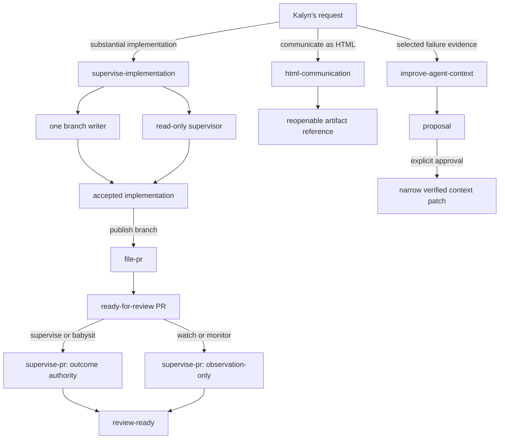

# Personal agent skills: research and resolved prototype plan

Date: 2026-08-18

Decision review completed: 2026-08-19

Migrated to `@kkb/agents`: 2026-08-21

Source provenance: `research` commit `cd225e7a40d81d2e2a19505b6123309b16c1c0ec`. The original research files remain untouched historical prototypes; this package is authoritative.

## Purpose and status

This note preserves the research and decisions behind five personal software-development skill prototypes:

- [`file-pr`](../skills/file-pr/SKILL.md)
- [`supervise-pr`](../skills/supervise-pr/SKILL.md)
- [`html-communication`](../skills/html-communication/SKILL.md)
- [`supervise-implementation`](../skills/supervise-implementation/SKILL.md)
- [`improve-agent-context`](../skills/improve-agent-context/SKILL.md)

They are canonical, uninstalled assets in `@kkb/agents`. Their `SKILL.md` files and supporting package files are the operational sources; this dated note is the research and decision record rather than a second instruction set.

Stable terminology lives in [`CONTEXT.md`](../CONTEXT.md). Active work state belongs in the current request, session, issue, PR, and diff.

## Sources and method

The evidence pass covered:

- Theo's full 51-minute video and first-party English caption track: [My AGENTS.md & SKILLS.md Breakdown (Don't copy them)](https://www.youtube.com/watch?v=e1snsuY4lTI);
- repository instructions, source, tests, CI, history, and selected artifacts in `research`, `wave-player-next`, `kalynbeach-net`, and `kkb`;
- targeted Codex and Pi configuration and sessions related to PR work, supervision, review, and visual communication;
- the established sole-writer/read-only-supervisor workflow from Wave Player work;
- the local `writing-for-agents`, `skill-creator`, and MIT-licensed `visual-explainer` packages.

The config and session pass excluded credentials, authentication material, private datasets, and unrelated session content.

Theo's most durable contribution is procedural: grow agent context from observed personal failures instead of copying another person's files. A skill description is an invocation pointer; the procedure belongs in the body. Independently requested workflows, such as filing and supervising a PR, should remain separate. Sources: [09:00–10:02](https://www.youtube.com/watch?v=e1snsuY4lTI&t=540s), [12:26–14:00](https://www.youtube.com/watch?v=e1snsuY4lTI&t=746s), [19:53–24:13](https://www.youtube.com/watch?v=e1snsuY4lTI&t=1193s), [50:18–51:07](https://www.youtube.com/watch?v=e1snsuY4lTI&t=3018s).

The PR workflows also retain his useful mechanics: inspect the complete diff, explain the human problem and outcome, act only on current CI and review evidence, prove bot findings against source, distinguish defects from infrastructure failures, and keep review feedback inside scope. Sources: [10:24–12:24](https://www.youtube.com/watch?v=e1snsuY4lTI&t=624s), [15:00–18:21](https://www.youtube.com/watch?v=e1snsuY4lTI&t=900s).

## Context-hygiene decisions

Repository context should stay minimal:

- executable truth: source, tests, and configuration;
- concise repository instructions;
- stable domain language in `CONTEXT.md`;
- accepted ADRs;
- actual product and user documentation.

Generated plans, research, audits, reports, and evidence are reopenable artifacts outside the repository by default. The provisional local home is `~/.agent/artifacts/<project>/`. A new repository artifact requires an explicit request, an established repository convention, or an installed skill's essential artifact contract. A skill must name that essential output; an incidental desire to preserve work is insufficient.

Artifact references are storage-neutral: they carry a local path now and may carry a service ID or URL later, together with privacy, portability, and verification state. This lets future `@kkb/agents` tooling and the artifact service change storage without rewriting skill semantics.

Repository discovery therefore starts with the current request and active work surfaces, then repository instructions and the current source/diff, then only directly relevant stable context. It does not begin by scanning `docs/` for a latest plan or report.

## Shared operating decisions

All five skills are model-invokable and can also be invoked manually by name.

GitHub access mechanism and actor identity are separate decisions. Prefer a capable harness-native connector, app, or integration; use `gh` when a harness lacks one. Visible agent writes should use an agent or app actor. Acting as `kalynbeach` requires explicit authorization.

Attribution reflects meaningful involvement, not contribution-graph optimization. When Kalyn materially prompts, directs, orchestrates, or decides agent work, authorship or co-authorship should truthfully preserve that involvement. Agent-only authorship is reserved for genuinely autonomous work. For now, skills preserve configured Git identity rather than silently rewriting it; dedicated portable agent identities remain a future setup task.

## Skill decisions

### `file-pr`

Invocation authorizes auditing the complete PR scope, staging intended paths, committing already-intended work, pushing, and opening or updating a ready-for-review PR. Draft state requires an explicit request or repository rule.

The skill cannot implement a newly discovered fix, merge, close, alter branch protection, or expand scope. A defect found during filing blocks delivery until separate implementation authority resolves it. A globally clean worktree is unnecessary; PR-scope cleanliness is required.

The PR body begins with a Summary that states the problem and outcome in plain language for Kalyn. It also contains `Agent: <model> via <harness>`, or `Agents: ...` for multiple agents that materially created, implemented, or owned the change. Reviewers, read-only supervisors, and agents making only minor corrections are not listed there.

### `supervise-pr`

Explicit `supervise-pr`, "supervise," or "babysit" invocation grants outcome authority for narrow fixes, focused tests, commits, normal pushes, evidence-based replies and thread resolution, and materially necessary lease-protected rebases. A request only to "watch" or "monitor" is observation-only.

Supervision owns branch mutations unless another agent currently has the explicit writer assignment and is reachable or known to be working. Historical authorship does not preserve ownership after the implementation agent stops.

Every reviewer claim is independently proved against the latest head, intended behavior, and agreed scope. Invalid, misleading, stale, duplicate, and out-of-scope claims receive one evidence-based disposition and do not trigger appeasement changes or repeated debate without new evidence.

`review-ready` requires applicable checks and automated review, no **valid** unresolved actionable finding, sufficient mergeability and freshness, an accurate PR body and existing linked artifacts, PR-scope cleanliness, and no known critical runtime defect. Human approval remains separate. The skill never merges or closes.

### `html-communication`

This is an independent KKB skill, not a wrapper around or runtime invocation of `visual-explainer`. It selectively adapts useful composition, responsive-document, Mermaid, and verification techniques into KKB-owned references and assets without vendoring the other package.

The initial package owns a small standalone shell, a composition reference, and a diagram reference. The provisional shell supplies consistent base typography, semantic tokens, complete light and dark styles, system-mode default, and a lightweight manual mode control. Each artifact adds content-specific styling. A future stable KKB artifact-theme package should generate or supply this base across machines; the skill should not depend on a product app's private source tree.

Representation follows content: prose for sustained reading, semantic tables for repeated mappings, Mermaid for relationships or state, structured cards for scannable internals and findings, and a small overview plus detailed prose or cards for dense systems.

Evidence rigor and verification are proportional. Dense factual artifacts require an explicit evidence ledger; simple explainers and mocks require a lighter source-and-coverage check. Every artifact is browser-verified at relevant desktop and narrow sizes, in light and dark modes, with used interactions and console state checked.

Creation defaults to unpublished local HTML. Privacy levels are `private`, `restricted`, and `public`; creation never publishes. Private artifacts use embedded or local dependencies. Publishing is a separate future workflow.

### `supervise-implementation`

This workflow coordinates exactly one branch writer and one independent repository-read-only supervisor against an acceptance contract. If Kalyn invokes it, use it. If unrequested work appears substantial and the skill is available, ask whether to use it before implementation begins.

The supervisor checks source, tests, runtime evidence, scope, and Git state without editing. If the writer stops, the supervisor inspects current state, writes an agent-optimal handoff prompt, sends it as the replacement writer's initial message, and only then transfers sole-writer ownership. No repository plan or implementation report is required; code, tests, runtime behavior, and acceptance evidence are the proof.

### `improve-agent-context`

This skill analyzes explicitly selected runs, corrections, and artifacts for repeated or sufficiently harmful agent failures. It diagnoses the failure mechanism, chooses the smallest responsible context surface, and proposes an evidence-backed diff plus forward test. It prefers replacing stale or conflicting text over accumulating rules.

The first phase is read-only and proposal-first. After explicit approval, the same skill may apply and verify only the approved narrow change. It does not broadly mine unrelated history or install, sync, or publish context beyond the authorized target.

## Workflow map

| Skill | Default authority | Hard boundary |
|---|---|---|
| `file-pr` | Audit, commit intended work, push, open a ready PR | No new implementation, merge, or close |
| `supervise-pr` | Narrow evidence-backed PR repair unless observation-only | No concurrent writing, appeasement changes, merge, or close |
| `html-communication` | Create and verify a reopenable local HTML artifact | No product UI or publication |
| `supervise-implementation` | Coordinate one writer and one read-only supervisor | No parallel writers or implied PR publication |
| `improve-agent-context` | Analyze selected evidence and propose a patch | No mutation before approval or scope expansion after it |

## Deferred work

- `publish-artifact` waits for the future KKB artifact service to define authentication, privacy enforcement, storage, and URL contracts. The likely stack is Next.js, Convex, and Clerk, but current skills depend only on the storage-neutral artifact reference.
- A combined `ship-pr` router remains unnecessary while filing and supervision are independently requested.
- A separate commit skill remains unjustified without a demonstrated trigger or consistency problem.
- A hosted HTML reader remains deferred until shared artifact URLs are common.
- Claude review-agent context is a separate workstream; `supervise-pr` must robustly classify invalid findings immediately rather than depend on that future cleanup.

## Migration boundary

The original prototype pass updated three skills, added two more, added the minimal HTML shell and focused references, and aligned repository context guidance. This migration copies those operational assets into `@kkb/agents`, validates their package integrity, and forward-tests `html-communication` without installing or publishing it. The remaining skills still require realistic non-publishing forward tests before installation. Installation and synchronization tooling remain deferred.
